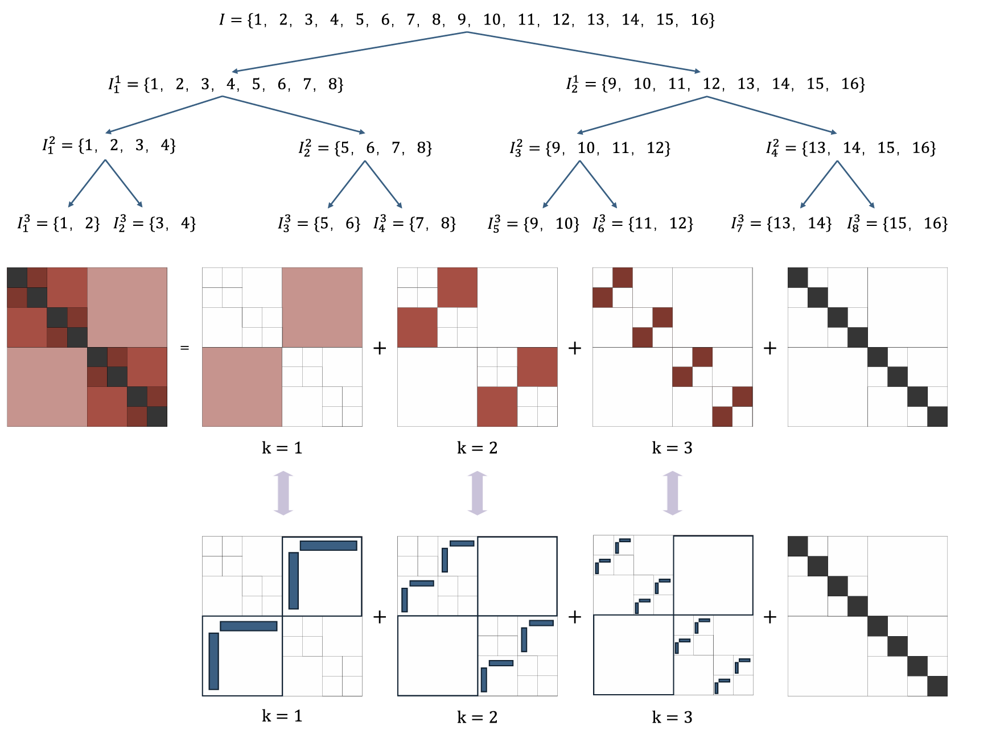

.. MHODLR documentation

Welcome to MHODLR's documentation!
===================================

Hierarchical Off-Diagonal Low-Rank (HODLR) matrices are structured matrices formulated by hierarchically partitioning a dense matrix based on a binary cluster tree. At each level of this hierarchical structure, the off-diagonal blocks are approximated as low-rank matrices, significantly reducing the storage and computational complexity compared to fully dense representations. HODLR matrices are widely used in scientific computing applications, including solving large-scale linear systems, integral equations, and kernel-based machine learning problems, due to their ability to exploit matrix sparsity and low-rank structures effectively.

This repository focuses on the efficient implementation and simulation of HODLR matrices in MATLAB. It provides a robust and user-friendly API for performing essential HODLR operations, such as matrix construction, factorization, and solving linear systems. Additionally, the repository includes tools for mixed-precision simulations, enabling users to explore the impact of different numerical precisions on HODLR computations.

Precision tuning plays a critical role in balancing computational efficiency, memory usage, and numerical accuracy. Lower-precision arithmetic, such as single and half precision, is particularly attractive due to its ability to reduce data communication costs and achieve energy and storage efficiency. According to the IEEE standard for floating-point arithmetic, single-precision operations can be up to twice as fast as double precision on certain hardware platforms, while half-precision arithmetic can deliver up to a 4x speedup over double precision.

Using the software mhodlr, users can evaluate the numerical trade-offs in HODLR matrix computations. The package allows for the simulation of various precisions, enabling users to assess reconstruction errors during matrix construction and computation errors during downstream operations. This feature empowers researchers and practitioners to identify the optimal precision settings tailored to their specific problem requirements, leading to faster computations without compromising accuracy.

Guide
-------------

.. toctree::
   :maxdepth: 2
   
   start.rst
   hodlr_build.rst
   matrix_compute.rst
   precision.rst
   api_ref.rst

Others
-------------
.. toctree::
   :maxdepth: 2
   
   teams.rst
   acknow.rst
   license.rst

Indices and Tables
-------------------

* :ref:`genindex`
* :ref:`modindex`
* :ref:`search`
